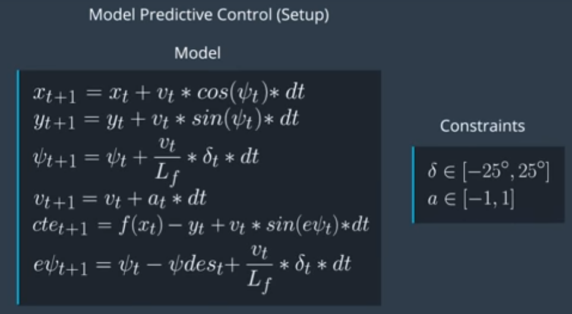

# CarND - MPC Project, student write-up.

## Student describes their model in detail. This includes the state, actuators and update equations.
The objective was to use Model Predictive Control, to drive a car successfully round the simulator track.
Here is the model used:

These come from Lessons 18 and 19 in the course.

The car state we use includes:
- current x, y position
- current heading (psi)
- current velocity 

We calculate cte (cross track error) and epsi (psi error).
The car itself has two actuators; the steering angle and throttle. These were constrained to +/- 25° and +/- 1. 

A cost function was created, where different criteria were considered, and given appropriate weighting.
- how far away from the desired position the car was (cross track error)
- deviation of our heading (orientation error).
- velocity cost (trying to travel at speed).
- smoothness of heading / throttle changes, to focus on smoother driving (rapid changes in current state, but also comparing with previous values of steering angle and acceleration, making control decisions more consistent).

## Tuning of cost function.
Initially my car went backwards! So I went through the equations until I worked out where the bugs were and fixed them.

From there, my starting position was to use the values derived from the course video. These place a high emphasis on cte and orientation. 
As soon as I set the latency to 100ms, these values had the car doing significant amount of fishtailing and spinning off the track.
So I reduced the speed down somewhat, and looked at predicting my state rather than assuming zero for a number of the variables (see below).
Even so, I had the difficulty that when on the ideal line, the car would still rapidly steer towards either side of the line. 
I tuned the weights, initially going for a smoother turn rate. This helped but meant we couldn't make turns. Smoother motion came when started de-emphasising ideal position, turning it down but not to zero.
I found a balanced of a very slight emphasis on cross track error, compared with much a greater emphasis on heading. Furthermore, I couldn't have too smooth a turn rate or the car couldn't make the turn after the bridge (where it needs to get full lock rapidly).

# Timestep Length and Elapsed Duration (N & dt)
## Student discusses the reasoning behind the chosen N (timestep length) and dt (elapsed duration between timesteps) values. 

For driving round at racetrack speeds, it doesn't make sense to predict more than 1-2 seconds into the future. For certain sections such as tight bends, the required inputs even just 1 second later could be radically different. Were we driving a train, with much slower acceleration then we may want to look further ahead. 
For MPC we have T = N * dt. Given a desired T of 1s, I started out with N = 10, dt = 0.1. I was able to tune my model's weights satisfactorily using these values, but also looked at N = 20, dt = 0.05; another popular choice on the forums.
For fun I also tried N = 50, dt = 0.1.

# Polynomial Fitting and MPC Preprocessing
## A polynomial is fitted to waypoints.
## If the student preprocesses waypoints, the vehicle state, and/or actuators prior to the MPC procedure it is described.

The x, y values are transformed into vehicle space i.e. so that the vehicle is at 0, 0.

# Model Predictive Control with Latency
## The student implements Model Predictive Control that handles a 100 millisecond latency. 
## Student provides details on how they deal with latency.

To cope with the latency, I did some tuning as described previously. I also took the previous state (velocity, steering angle, throttle etc) and estimated the state 100ms later, using this as an input to my model.

# Video of car
I settled on a speed of 50 for passing the project requirement. A video of the car driving round the track can be found here:

